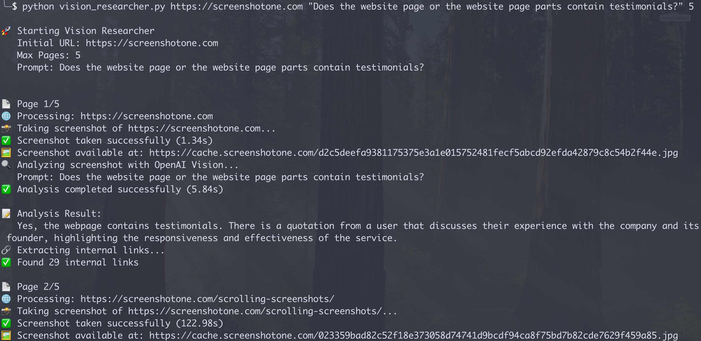

# Vision Researcher

It is a demonstration application that uses ScreenshotOne API to render a full-page screenshot of website pages, apply OCR to it, and search for given patterns.

It uses the following technologies:

-   [ScreenshotOne API—the best screenshot API](https://screenshotone.com);
-   [OpenAI Vision API (for OCR)](https://platform.openai.com/docs/guides/vision).

Check out more examples in the [ScreenshotOne examples](https://github.com/screenshotone/examples) repository.

## How it works

You provide an URL via the CLI argument and the application will:

1. Take a full-page screenshot of the given URL;
2. Split the screenshot into multiple parts;
3. Apply OCR to each part;
4. Search for the given patterns in the OCRed parts by asking AI to answer that if the pattern is present in the part;
5. Then it will get the HTML content of the page;
6. Parse links and navigate to the internal links.
7. And repeat the process from step 1 for the new page till it finds the match of the given patterns on the OCRed part of the page.
8. Then it will print the results.

The code was written with the help of [Cursor](https://www.cursor.com/) as specified in the [instructions](./instructions.md).

## How to build and run

1. Clone the repository:

```bash
git clone https://github.com/screenshotone/examples.git
```

2. Install the dependencies:

```bash
pip install -r requirements.txt
```

3. Create a `.env` file and set the following environment variables:

```bash
SCREENSHOTONE_API_KEY=your_screenshotone_api_key
OPENAI_API_KEY=your_openai_api_key
```

4. Run the application:

```bash
python vision_researcher.py <url> <prompt> <max pages>
```

For example, to search for the content containing "testimonials" on [the ScreenshotOne website](https://screenshotone.com):

```bash
python vision_researcher.py https://screenshotone.com "Does the website page or the website page parts contain testimonials?" 5
```

The results will be printed in the console:

